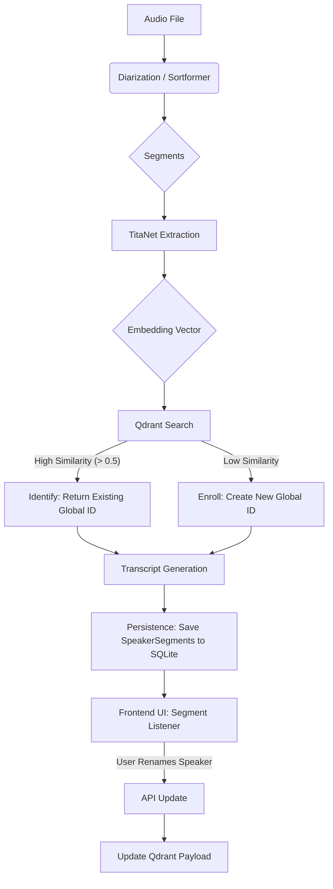

# The Life of a Speaker

This document provides a comprehensive overview of the incremental open-set speaker identification system ("Forever Learning") implemented in Scriberr. It explains how speakers are detected, identified, stored, and managed throughout the application lifecycle.

## Architectural Overview

The system transitions from a traditional session-based diarization model (where "Speaker 0" is unique only to *that* file) to a persistent identity model (where "Speaker 0" is identified as "Alice" across all files).

### Core Components

1.  **Audio Processing Pipeline (Go)**: The central orchestrator (`UnifiedTranscriptionService`).
2.  **Diarization Engine (Sortformer)**: Segments audio into speaker turns (time-stamped segments).
3.  **Identification Engine (TitaNet)**:
    *   **Model**: Nvidia TitaNet Large (Encoder-Decoder architecture).
    *   **Function**: Extracts 192-dimensional embeddings from audio segments.
    *   **Logic**: Implements Open-Set Recognition (Identify vs. Enroll).
4.  **Long-Term Memory (Qdrant)**: A Vector Database that stores speaker embeddings and metadata (Names, IDs).
5.  **API & Frontend**: Allows users to manage identities (rename "Speaker-UUID" to "Human Name").
6.  **Segment Store (SQLite)**: Persists timestamped audio segments linked to speakers for UI playback and verification.

### Data Flow



---

## Lifecycle Stages

### 1. Birth: Enrollment (The "Unknown" Speaker)
When an audio file is processed, the system first performs standard diarization to find *where* people are speaking. Then, for each local speaker (e.g., `speaker_0` in *this* file):
1.  **Extraction**: The system aggregates the longest audio segments for `speaker_0` and passes them to TitaNet.
2.  **Vectorization**: TitaNet produces a normalized embedding vector representing the speaker's voice print.
3.  **Query**: This vector is queried against the `speakers` collection in Qdrant.
4.  **Decision**:
    *   If no vector in Qdrant has a cosine similarity > 0.5, the system assumes this is a **new speaker**.
    *   It generates a new UUID (e.g., `a1b2-c3d4...`) and inserts the vector into Qdrant with the name `Speaker-a1b2...`.
    *   The transcript is tagged with this Global ID.

### 2. Recognition: Identification (The "Known" Speaker)
When the same person speaks in a *future* file (or later in the same file):
1.  The embedding is extracted again.
2.  The Qdrant query returns a match (Similarity > 0.5) with the existing `a1b2-c3d4...` record.
3.  The system retrieves the stored name (e.g., "Alice" if it was renamed, or "Speaker-a1b2..." if not).
4.  The transcript is tagged with this existing Global ID.

### 3. Maturation: Management (Renaming & Merging)
Users interact with these identities via the Web UI:
1.  **Renaming**: In the transcript editor, a user renames "Speaker-a1b2..." to "Alice".
    *   The user checks **"Also rename globally"**.
    *   The Frontend calls `PUT /api/v1/speakers/{uuid}` with the new name "Alice".
    *   The backend `SpeakerService` receives the request and performs a two-step process:
        1.  **Fetch Old Name**: It first queries Qdrant using the speaker's UUID (`a1b2-c3d4...`) to retrieve the current name ("Speaker-a1b2...").
        2.  **Update Qdrant**: It updates the metadata payload in Qdrant for that speaker's vector, setting the name to "Alice". All future identifications of this voice will now correctly return "Alice".
        3.  **Retroactive Update**: The service then queries the main application database for all `TranscriptionJob` records. It iterates through each completed transcript, finds all occurrences of the old name ("Speaker-a1b2..."), and replaces them with the new name ("Alice").
    *   **Effect**: All future identifications of this voice will return "Alice", and all previously recorded transcripts are updated to reflect the new name, ensuring consistency across the entire application.

2.  **Deletion**: A user deletes a speaker profile via API.
    *   The vector is removed from Qdrant.
    *   Future occurrences of this voice will trigger a new Enrollment (new UUID).

### 4. Persistence: The Audio Audit Trail (Reference Samples)
To allow users to verify identities, the system saves the raw segments used for identification:
1.  **Selection**: The `titanet_identify.py` script selects the top 10 longest audio segments for each speaker to create their voice embedding.
2.  **Tagging**: These segments are tagged with `is_reference: True`.
3.  **Storage**: The `UnifiedTranscriptionService` saves only these reference segments (start, end, text) to the `speaker_segments` table in SQLite.
4.  **Retrieval**: The Frontend fetches these via `GET /api/v1/speakers/{id}/segments` to provide a "Listen to Speaker Samples" UI.

---

## Debugging & Troubleshooting

### 1. Verifying Infrastructure
Ensure Qdrant is running and accessible.
```bash
# Check container status
docker ps | grep qdrant

# Query Qdrant Collection Info
curl http://localhost:6333/collections/speakers
```

### 2. Inspecting Speaker Data
You can list all enrolled speakers and their persisted segments using the API.

**List Speakers:**
```bash
curl -H "X-API-Key: $SCRIBERR_API_KEY" http://localhost:5318/api/v1/speakers/
```

**Fetch Speaker Segments (Samples):**
```bash
curl -H "X-API-Key: $SCRIBERR_API_KEY" http://localhost:5318/api/v1/speakers/{uuid}/segments
```

**Direct Database Inspection:**
See [docs/debugging-speakers.md](debugging-speakers.md) for SQLite commands to inspect segments directly.

**Using the Python Script (Directly):**
If you need to debug the Python environment or Qdrant content directly from the backend container:
```bash
# Enter backend container
docker exec -it scriberr-scriberr-1 bash

# Activate environment
cd data/whisperx-env/parakeet

# Run management script
uv run python titanet_manage.py list --qdrant qdrant
```

### 3. Analyzing TitaNet Logs
The identification process logs to `data/transcripts/{job_id}/transcription.log`.
Look for:
*   `Loading TitaNet...`
*   `Matched local speaker_0 to Global_ID_XYZ (score: 0.85)` -> Successful ID.
*   `Enrolling new speaker Speaker-XYZ` -> New speaker creation.

### 4. Common Issues

**"Speaker Rename didn't work globally"**
*   **Cause**: The frontend might have sent the *Name* ("Speaker-123") instead of the *UUID* if the lookup failed.
*   **Check**: Look at the network request in browser DevTools. The URL should be `/api/v1/speakers/UUID-Here`, not `/api/v1/speakers/Speaker-Name`.

**"Identified as wrong person"**
*   **Cause**: Similarity threshold (0.5) might be too low, or audio quality is poor (short segments).
*   **Fix**: Adjust `similarity_threshold` in the job parameters or via the `TitanetAdapter` configuration.

**"Script failed with ImportError"**
*   **Cause**: Missing dependencies in the Python environment.
*   **Fix**: Check `internal/transcription/adapters/sortformer_adapter.go` dependencies list. It must include `nemo-toolkit[asr]`, `qdrant-client`, `torch`, etc.
